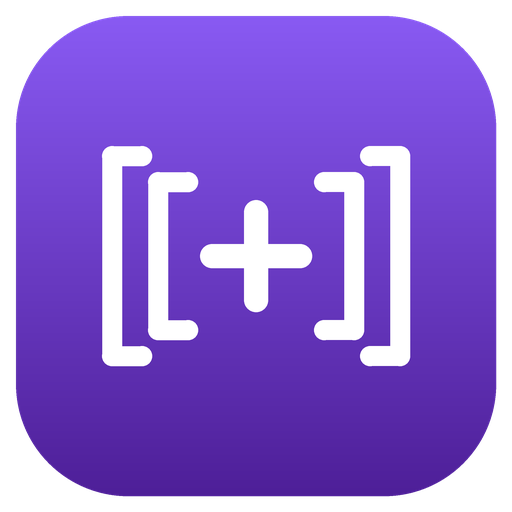
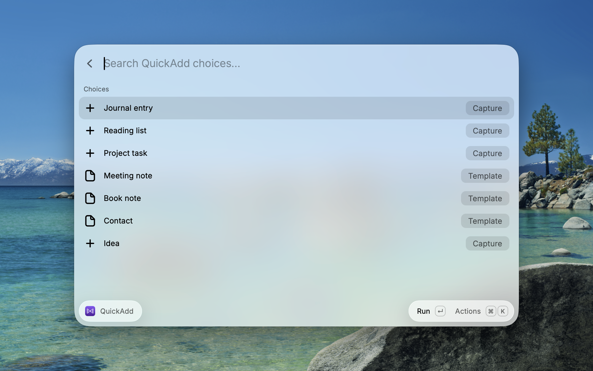
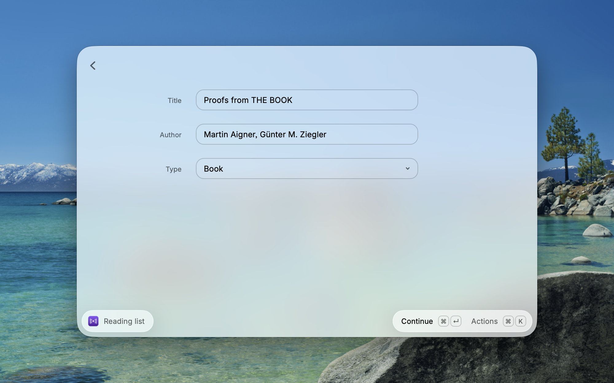
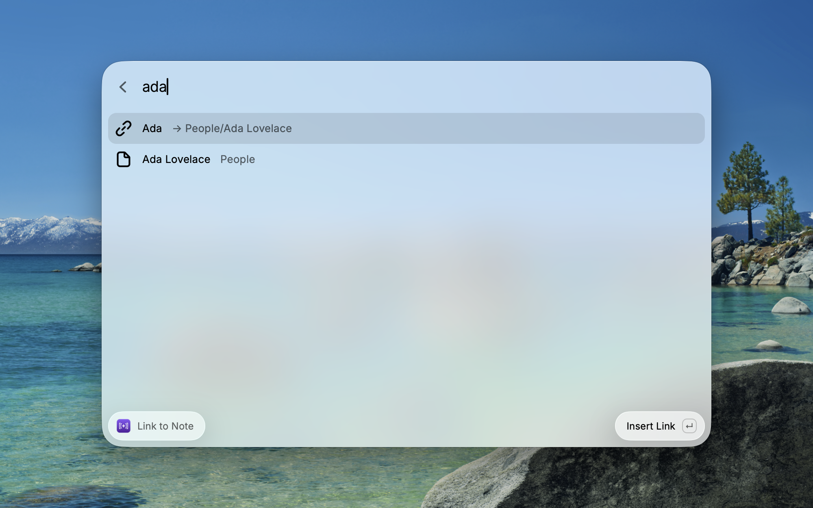

<p align="center">
  
</p>

<h1 align="center">Obsidian QuickAdd for Raycast</h1>

<p align="center">Run your <a href="https://github.com/chhoumann/quickadd">QuickAdd</a> choices from Raycast and answer everything they ask without leaving what you're doing.</p>

<p align="center"><sub>An unofficial companion to <a href="https://github.com/chhoumann/quickadd"><b>QuickAdd</b></a>, the Obsidian plugin by Christian B. B. Houmann (<a href="https://quickadd.obsidian.guide/docs/">docs</a>).</sub></p>

<p align="center">
  
</p>

## Highlights

- **Everything QuickAdd asks, answered in Raycast.** Text, one-page forms, dropdowns, file and tag pickers, multi-selects, checkboxes, dates and times, confirmations. The extension drives QuickAdd's own interactive mode, so choices behave exactly as they do in Obsidian: no re-implementation, nothing to configure twice.
- **Stays out of your way.** Captures run with Obsidian in the background. Obsidian only comes forward when a choice is set to open its note.
- **`[[` links and `#` tags, as in Obsidian.** Type `[[` in any field to link a note, alias or attachment, or `#` to pick one of your tags (most used first). The suggestions come from Obsidian's own index and respect your vault's file settings.
- **A hotkey for any choice.** Select a choice, press `⌘⇧Q` to save it as a quicklink, and give it an alias or hotkey in Raycast.
- **Works when Obsidian isn't open.** It opens the vault, or starts Obsidian, and brings Raycast back with your form.
- **Always picks up your setup.** Choices are read from QuickAdd's settings each time, so new and renamed choices appear immediately.

<p align="center">
  
  
</p>

## Requirements

- Obsidian with the [QuickAdd](https://github.com/chhoumann/quickadd) plugin, version 2.27 or later.
- For full support: Obsidian 1.12 or later with **Settings → General → Advanced → Command line interface** turned on (restart Obsidian afterwards).

Without the command-line interface the extension still works in **basic mode**. It asks for `{{VALUE}}` fields in Raycast and sends them through QuickAdd's `obsidian://quickadd` link, and anything else is asked in Obsidian. The choice list tells you when basic mode is on and why.

## Install

```sh
git clone https://github.com/ievlevpn/raycast-obsidian-quick-add.git
cd raycast-obsidian-quick-add
npm install
npm run dev
```

`npm run dev` adds the extension to Raycast; it stays there after you stop the command. The vault is found automatically when only one vault has QuickAdd. Otherwise pick it from the list or set **Vault Folder** in the extension's preferences.

## Limitations

- Templater's own prompts (`tp.system.prompt` and similar) and dialogs opened by scripts appear in Obsidian. Raycast shows that it's waiting and offers **Open Obsidian** (`⌘O`).
- `{{selected}}` and `{{linkcurrent}}` come from Obsidian's active editor.
- QuickAdd sends file-picker and field-suggest inputs without their options, so they are plain text fields.
- In basic mode, `[[` suggests notes only (no aliases or attachments) and `#` has no suggestions.

## Development

```sh
npm test       # unit tests
npm run dev    # run in Raycast
npm run lint
```

`e2e-vault/` is a small vault with one QuickAdd choice per prompt type, for trying the extension by hand. Copy QuickAdd's plugin files into it with `scripts/setup-e2e-vault.sh /path/to/vault/.obsidian/plugins/quickadd`, then open the folder as a vault in Obsidian and trust its plugins. Reset it with `git checkout -- e2e-vault && git clean -fd e2e-vault`.

## License

MIT
